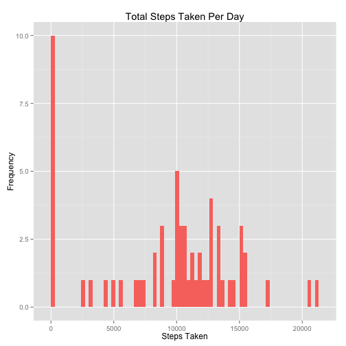
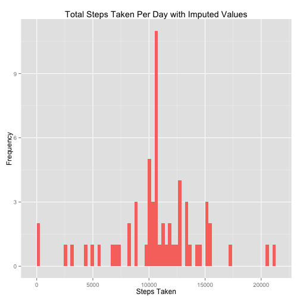

# Reproducible Research: Peer Assessment 1


This assignment makes use of data from a personal activity monitoring device. This device collects data at 5 minute intervals through out the day. The data consists of two months of data from an anonymous individual collected during the months of October and November, 2012 and include the number of steps taken in 5 minute intervals each day.

## Loading and preprocessing the data

Unzip the data from the activity.zip file and load into a data frame called activity:


```r
if (!file.exists("activity.csv")) {
    unzip("activity.zip")
}
activity <- read.csv("./activity.csv")
```

Assuming the 5-minute intervals start being timed from midnight, I used the interval column to create a date.time and a time column:

```r
times <- formatC(activity$interval/100, 2, format = "f")
activity$date.time <- as.POSIXct(paste(activity$date, times), format="%Y-%m-%d %H.%M")
activity$time <- format(activity$date.time, format = "%H:%M:%S")
```


## What is mean total number of steps taken per day?

First, calculate the total number of steps taken per day


```r
total.steps <- tapply(activity$steps, activity$date, sum, na.rm = TRUE)
```

Representing this as a historgram of steps taken per day


```r
library(ggplot2)
qplot(total.steps, binwidth=300, fill="salmon", xlab="Steps Taken", ylab="Frequency", main="Total Steps Taken Per Day") + theme(legend.position="none")
```

 

The **mean** number of steps taken per day can be calculated as:


```r
mean(total.steps)
```

```
## [1] 9354
```

The **median** number of steps taken per day can be calculated as:


```r
median(total.steps)
```

```
## [1] 10395
```

## What is the average daily activity pattern?

To begin, calculate the mean number of steps per time interval:


```r
mean.steps <- tapply(activity$steps, activity$time, mean, na.rm=TRUE)
```

Convert the array to a data frame object


```r
mean.steps.df <- data.frame(time=as.POSIXct(names(mean.steps), format="%H:%M:%S"), avgsteps = mean.steps)
```

The following shows a time series plot of the 5-minute intervals and the average number of steps taken, averaged across all days:


```r
library(scales)
ggplot(mean.steps.df, aes(time, avgsteps)) + geom_line() + xlab("Time of day") + 
    ylab("Average number of steps taken") + scale_x_datetime(labels = date_format(format = "%H:%M"))
```

 

From this time series plot, the time interval with the most number of steps is: 


```r
maxelement <- which.max(mean.steps.df$avgsteps)
format(mean.steps.df[maxelement, "time"], format = "%H:%M")
```

```
## [1] "08:35"
```

## Imputing missing values

The number of rows with missing values (NA) is calculated as:


```r
NAsubset <- activity[is.na(activity$steps), ]
nrow(NAsubset)
```

```
## [1] 2304
```

In order to "fill" these missing values, each NA is replaced with the mean of the 5-minute interval


```r
library(Hmisc)
```

```
## Loading required package: grid
## Loading required package: lattice
## Loading required package: survival
## Loading required package: splines
## Loading required package: Formula
## 
## Attaching package: 'Hmisc'
## 
## The following objects are masked from 'package:base':
## 
##     format.pval, round.POSIXt, trunc.POSIXt, units
```

```r
activity.filled <- activity
activity.filled$steps <- impute(activity.filled$steps, mean)
```

The following is a histogram of the total steps taken per day with the imputed values:


```r
total.steps.filled <- tapply(activity.filled$steps, activity.filled$date, sum)
qplot(total.steps.filled, binwidth=300, fill="salmon", xlab="Steps Taken", ylab="Frequency", main="Total Steps Taken Per Day with Imputed Values") + theme(legend.position="none")
```

 

Comparing the **mean** of the original data:

```r
mean(total.steps)
```

```
## [1] 9354
```

to the **mean** of the imputed data:

```r
mean(total.steps.filled)
```

```
## [1] 10766
```

it can be seen that the **mean** of the imputed data is slightly higher.

Comparing the **median** of the original data:


```r
median(total.steps)
```

```
## [1] 10395
```

to the **median** of the imputed data:

```r
median(total.steps.filled)
```

```
## [1] 10766
```

it can be seen that the **median** of the imputed data is again slightly higher, and also equal to the **mean** of the imputed data. Thus the effect of missing values can be considered non-trivial.

## Are there differences in activity patterns between weekdays and weekends?
Create a new factor variable in the dataset with two levels – “weekday” and “weekend” indicating whether a given date is a weekday or weekend day.

The following adds a factor variable (of 2 levels: "weekday" and "weekend") to the imputed data.


```r
day <- function(date) {
  if (weekdays(date) %in% c("Monday", "Tuesday", "Wednesday", "Thursday", "Friday"))
    return("weekday")
  else
    return("weekend")
}

get.days <- sapply(activity.filled$date.time, day)
activity.filled$day <- as.factor(get.days)
head(activity.filled)
```

```
##   steps       date interval           date.time     time     day
## 1 37.38 2012-10-01        0 2012-10-01 00:00:00 00:00:00 weekday
## 2 37.38 2012-10-01        5 2012-10-01 00:05:00 00:05:00 weekday
## 3 37.38 2012-10-01       10 2012-10-01 00:10:00 00:10:00 weekday
## 4 37.38 2012-10-01       15 2012-10-01 00:15:00 00:15:00 weekday
## 5 37.38 2012-10-01       20 2012-10-01 00:20:00 00:20:00 weekday
## 6 37.38 2012-10-01       25 2012-10-01 00:25:00 00:25:00 weekday
```

The following is a panel plot contrain a time series plot of the 5-minute interval and the average number of steps taken, averaged across all weekday days or weekend days:


```r
mean.steps.filled <- tapply(activity.filled$steps, interaction(activity.filled$time, activity.filled$day), 
                     mean, na.rm = TRUE)
ww = c(rep("weekday", 288), rep("weekend", 288))
mean.steps.filled.df <- data.frame(time=as.POSIXct(names(mean.steps.filled), format="%H:%M:%S"), avgsteps = mean.steps.filled, day = as.factor(ww))
ggplot(mean.steps.filled.df, aes(time, avgsteps)) + geom_line() + xlab("Time of day") + 
    ylab("Average number of steps taken") + scale_x_datetime(labels = date_format(format = "%H:%M")) +
    facet_wrap(~ day, nrow=2)
```

 

